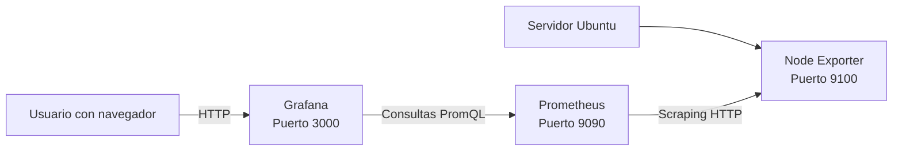

# Entorno de laboratorio

Esta sección describe el entorno utilizado durante el curso para instalar, configurar y probar Grafana, Prometheus y Node Exporter.

El laboratorio se basa en un servidor Ubuntu que ejecuta los tres componentes principales:

```text
Ubuntu
├── Grafana
├── Prometheus
└── Node Exporter
```

El objetivo es que cada alumno pueda identificar los recursos del sistema, comprobar el estado de los servicios y documentar la configuración antes de comenzar las prácticas.

---

## Sistema operativo

La plataforma base del laboratorio utiliza Ubuntu.

| Propiedad | Valor |
|---|---|
| Distribución | Ubuntu |
| Versión | 24.04.5 LTS |
| Codename | Noble |
| Arquitectura recomendada | `amd64` / `x86_64` |
| Hostname | Pendiente |
| Dirección IP | Pendiente |
| Zona horaria | Pendiente |
| Usuario principal | Pendiente |

### Comprobar la distribución y la versión

Ejecutar:

```bash
lsb_release -a
```

Ejemplo de salida:

```console
$ lsb_release -a
No LSB modules are available.
Distributor ID: Ubuntu
Description:    Ubuntu 24.04.5 LTS
Release:        24.04
Codename:       noble
```

También puede consultarse el fichero del sistema:

```bash
cat /etc/os-release
```

### Comprobar la arquitectura

```bash
uname -m
```

Resultado esperado:

```text
x86_64
```

Consultar información adicional del kernel:

```bash
uname -a
```

### Comprobar el hostname

```bash
hostname
```

También puede utilizarse:

```bash
hostnamectl
```

Ejemplo:

```console
$ hostname
monitoring-01
```

Registrar el resultado:

```text
Hostname del laboratorio: ____________________
```

### Comprobar la dirección IP

Consultar todas las interfaces:

```bash
ip address
```

Mostrar únicamente las direcciones IPv4:

```bash
ip -4 address
```

Consultar la ruta predeterminada:

```bash
ip route
```

Ejemplo:

```console
$ ip -4 address show
2: ens33:
    inet 192.168.1.50/24 brd 192.168.1.255 scope global ens33
```

En este caso, la dirección IP del servidor sería:

```text
192.168.1.50
```

Para consultar rápidamente la IP de una interfaz concreta:

```bash
ip -4 addr show ens33
```

También se puede utilizar:

```bash
hostname -I
```

> La dirección mostrada puede variar según el tipo de red utilizado: red física, máquina virtual, NAT, bridge o laboratorio remoto.

Registrar el resultado:

```text
Interfaz principal: ____________________
Dirección IPv4: ________________________
Máscara o prefijo: ______________________
Puerta de enlace: ______________________
```

---

## Componentes

El entorno está compuesto por tres servicios principales:

| Componente | Función | Versión | Puerto | Estado |
|---|---|---:|---:|---|
| Grafana | Visualización y dashboards | Pendiente | 3000 | Pendiente |
| Prometheus | Recopilación y almacenamiento | Pendiente | 9090 | Pendiente |
| Node Exporter | Exposición de métricas del sistema | Pendiente | 9100 | Pendiente |

### Grafana

Grafana proporciona la interfaz web utilizada para:

- Crear dashboards.
- Consultar métricas.
- Configurar paneles.
- Definir umbrales.
- Crear alertas.
- Comparar periodos temporales.
- Añadir anotaciones.

La URL habitual de acceso es:

```text
http://<DIRECCION_IP>:3000
```

Ejemplo:

```text
http://192.168.1.50:3000
```

Comprobar si el servicio está instalado:

```bash
command -v grafana-server
```

Consultar la versión:

```bash
grafana-server -v
```

Consultar el estado:

```bash
sudo systemctl status grafana-server
```

Comprobar únicamente si está activo:

```bash
systemctl is-active grafana-server
```

Consultar el puerto:

```bash
sudo ss -lntp | grep ':3000'
```

Probar la respuesta HTTP local:

```bash
curl -I http://localhost:3000
```

### Prometheus

Prometheus recopila y almacena métricas en forma de series temporales.

Sus funciones principales son:

- Consultar objetivos de monitorización.
- Realizar operaciones de *scraping*.
- Almacenar muestras.
- Ejecutar consultas PromQL.
- Evaluar reglas de alerta.
- Proporcionar una API HTTP.

La URL habitual de acceso es:

```text
http://<DIRECCION_IP>:9090
```

Consultar la versión:

```bash
prometheus --version
```

Consultar el estado:

```bash
sudo systemctl status prometheus
```

Comprobar si está activo:

```bash
systemctl is-active prometheus
```

Comprobar el puerto:

```bash
sudo ss -lntp | grep ':9090'
```

Probar la respuesta HTTP local:

```bash
curl -I http://localhost:9090
```

Consultar la API de salud:

```bash
curl http://localhost:9090/-/healthy
```

Resultado esperado:

```text
Prometheus is Healthy.
```

### Node Exporter

Node Exporter recopila información del sistema operativo y la expone mediante un endpoint HTTP compatible con Prometheus.

Entre las métricas disponibles se encuentran:

- Uso de CPU.
- Memoria total y disponible.
- Sistemas de ficheros.
- Tráfico de red.
- Tiempo de actividad.
- Estado del sistema.
- Número de procesos.
- Información del kernel.

La URL habitual del endpoint es:

```text
http://<DIRECCION_IP>:9100/metrics
```

Consultar la versión:

```bash
node_exporter --version
```

Consultar el estado:

```bash
sudo systemctl status node_exporter
```

Comprobar si está activo:

```bash
systemctl is-active node_exporter
```

Comprobar el puerto:

```bash
sudo ss -lntp | grep ':9100'
```

Consultar las métricas:

```bash
curl http://localhost:9100/metrics
```

Mostrar únicamente las primeras líneas:

```bash
curl -s http://localhost:9100/metrics | head
```

Buscar métricas de CPU:

```bash
curl -s http://localhost:9100/metrics \
  | grep '^node_cpu_seconds_total' \
  | head
```

Buscar métricas de memoria:

```bash
curl -s http://localhost:9100/metrics \
  | grep '^node_memory_' \
  | head
```

---

## Arquitectura

La arquitectura del laboratorio puede representarse de la siguiente forma:



### Flujo de datos

El recorrido de una métrica es el siguiente:

1. El sistema operativo genera información.
2. Node Exporter recopila esa información.
3. Node Exporter publica las métricas en el puerto `9100`.
4. Prometheus consulta periódicamente el endpoint.
5. Prometheus almacena las muestras.
6. Grafana consulta Prometheus mediante PromQL.
7. Grafana representa los datos en dashboards.
8. Las alertas pueden detectar condiciones anómalas.

Representación simplificada:

```text
Sistema operativo
       |
       v
Node Exporter :9100
       |
       | Scraping
       v
Prometheus :9090
       |
       | PromQL
       v
Grafana :3000
       |
       v
Usuario
```

### Comunicación entre componentes

| Origen | Destino | Protocolo | Puerto | Finalidad |
|---|---|---|---:|---|
| Prometheus | Node Exporter | HTTP | 9100 | Recopilar métricas |
| Grafana | Prometheus | HTTP | 9090 | Ejecutar consultas |
| Navegador | Grafana | HTTP/HTTPS | 3000 | Acceder a la interfaz |
| Administrador | Servicios | SSH o consola | 22 | Administración |

### Funcionamiento del modelo *pull*

Prometheus utiliza normalmente un modelo *pull*. Esto significa que Prometheus inicia las conexiones y consulta los objetivos.

```text
Prometheus ---- consulta ----> Node Exporter
Prometheus <--- métricas ------ Node Exporter
```

Node Exporter no envía activamente los datos a Prometheus. En su lugar, mantiene disponible el endpoint:

```text
http://localhost:9100/metrics
```

Prometheus consulta dicho endpoint según el intervalo configurado en `prometheus.yml`.

---

## Usuarios

El laboratorio debe utilizar usuarios y permisos separados para reducir riesgos.

### Usuario administrador del laboratorio

Este usuario permite realizar tareas administrativas mediante `sudo`.

Comprobar el usuario actual:

```bash
whoami
```

Consultar su identificador:

```bash
id
```

Consultar sus grupos:

```bash
groups
```

Ejemplo:

```console
$ whoami
alumno

$ id
uid=1000(alumno) gid=1000(alumno) groups=1000(alumno),27(sudo)
```

Registrar los datos:

```text
Usuario principal: ______________________
UID: ____________________________________
Grupo principal: ________________________
¿Pertenece a sudo?: _____________________
```

### Usuarios de servicio

Los servicios no deberían ejecutarse con el usuario personal del alumno cuando exista la posibilidad de utilizar un usuario específico.

Usuarios habituales:

| Usuario | Servicio | Función |
|---|---|---|
| `grafana` | Grafana | Ejecutar Grafana |
| `prometheus` | Prometheus | Ejecutar Prometheus |
| `node_exporter` | Node Exporter | Exponer métricas |

Consultar los usuarios:

```bash
getent passwd grafana
getent passwd prometheus
getent passwd node_exporter
```

Ejemplo:

```console
$ getent passwd node_exporter
node_exporter:x:998:998::/home/node_exporter:/usr/sbin/nologin
```

El shell:

```text
/usr/sbin/nologin
```

impide que el usuario de servicio se utilice normalmente para iniciar una sesión interactiva.

### Comprobar el usuario de ejecución de un servicio

Para Grafana:

```bash
ps -ef | grep '[g]rafana'
```

Para Prometheus:

```bash
ps -ef | grep '[p]rometheus'
```

Para Node Exporter:

```bash
ps -ef | grep '[n]ode_exporter'
```

También se puede utilizar:

```bash
systemctl show grafana-server -p User
systemctl show prometheus -p User
systemctl show node_exporter -p User
```

### Recomendaciones de seguridad

- No utilizar `root` para ejecutar aplicaciones si no es necesario.
- No compartir contraseñas entre alumnos.
- Utilizar usuarios de servicio.
- No exponer los puertos del laboratorio directamente a Internet.
- Utilizar una red interna, VPN o cortafuegos.
- Mantener actualizado el sistema.
- Revisar los permisos de los ficheros de configuración.
- Guardar las credenciales fuera de repositorios públicos.
- No incluir contraseñas en capturas de pantalla ni ficheros de evidencias.

---

# Verificaciones iniciales

Antes de comenzar cualquier práctica, se debe comprobar que el sistema está correctamente preparado.

---

## Verificación 1: versión del sistema

Ejecutar:

```bash
lsb_release -ds
```

Resultado esperado:

```text
Ubuntu 24.04.5 LTS
```

Si el resultado es diferente, registrar la versión real:

```text
Versión detectada: ______________________
```

---

## Verificación 2: arquitectura y recursos

Consultar la arquitectura:

```bash
uname -m
```

Consultar la memoria:

```bash
free -h
```

Consultar los procesadores:

```bash
nproc
```

Consultar el espacio libre:

```bash
df -h /
```

Ejemplo:

```console
$ nproc
2

$ free -h
               total        used        free      shared  buff/cache   available
Mem:           3.8Gi       1.1Gi       710Mi        15Mi       2.0Gi       2.4Gi
Swap:          2.0Gi          0B       2.0Gi

$ df -h /
Filesystem      Size  Used Avail Use% Mounted on
/dev/sda2        40G   11G   27G  29% /
```

Registrar los resultados:

```text
CPU disponibles: _________________________
Memoria total: ___________________________
Memoria disponible: ______________________
Espacio libre en /: ______________________
```

---

## Verificación 3: sincronización horaria

Consultar el estado:

```bash
timedatectl status
```

Comprobar si el reloj está sincronizado:

```bash
timedatectl show -p NTPSynchronized --value
```

Resultado esperado:

```text
yes
```

Consultar la zona horaria:

```bash
timedatectl show -p Timezone --value
```

La hora es especialmente importante para:

- Ordenar correctamente las muestras.
- Interpretar dashboards.
- Comparar periodos.
- Analizar incidencias.
- Correlacionar métricas y logs.
- Evaluar alertas.

---

## Verificación 4: conectividad de red

Comprobar la dirección IP:

```bash
hostname -I
```

Comprobar la ruta predeterminada:

```bash
ip route | grep default
```

Comprobar resolución DNS:

```bash
getent hosts archive.ubuntu.com
```

Comprobar conectividad:

```bash
ping -c 4 8.8.8.8
```

Comprobar acceso HTTPS:

```bash
curl -I https://grafana.com
```

### Interpretar los resultados

| Prueba | Resultado | Interpretación |
|---|---|---|
| `ip address` | Hay una IP | La interfaz tiene configuración |
| `ip route` | Hay una ruta `default` | Existe una puerta de enlace |
| `getent hosts` | Devuelve una IP | DNS funciona |
| `ping` | Recibe respuestas | Hay conectividad IP |
| `curl -I` | Devuelve código HTTP | El acceso HTTP funciona |

---

## Verificación 5: disponibilidad de puertos

Comprobar los puertos del laboratorio:

```bash
for port in 3000 9090 9100; do
  echo "Comprobando puerto $port"
  if sudo ss -lnt "( sport = :$port )" | grep -q LISTEN; then
    echo "  Estado: ocupado"
  else
    echo "  Estado: libre"
  fi
done
```

Una vez instalados los servicios, el resultado esperado será similar a:

```text
Comprobando puerto 3000
  Estado: ocupado

Comprobando puerto 9090
  Estado: ocupado

Comprobando puerto 9100
  Estado: ocupado
```

Antes de instalar los servicios, los puertos pueden aparecer como libres.

### Identificar el proceso asociado

```bash
sudo ss -lntp | grep ':3000'
```

Ejemplo:

```console
LISTEN 0 4096 0.0.0.0:3000 0.0.0.0:* users:(("grafana",pid=1432,fd=8))
```

---

## Verificación 6: estado de los servicios

Consultar el estado de Grafana:

```bash
sudo systemctl status grafana-server
```

Consultar el estado de Prometheus:

```bash
sudo systemctl status prometheus
```

Consultar el estado de Node Exporter:

```bash
sudo systemctl status node_exporter
```

Comprobar todos de una vez:

```bash
for service in grafana-server prometheus node_exporter; do
  printf "%-20s" "$service"

  if systemctl is-active --quiet "$service"; then
    echo "activo"
  else
    echo "no activo"
  fi
done
```

Resultado esperado:

```text
grafana-server       activo
prometheus           activo
node_exporter        activo
```

Comprobar si arrancan automáticamente:

```bash
for service in grafana-server prometheus node_exporter; do
  printf "%-20s" "$service"
  systemctl is-enabled "$service" 2>/dev/null || true
done
```

---

## Verificación 7: comprobar Grafana

Probar la conexión local:

```bash
curl -I http://localhost:3000
```

Probar mediante la dirección IP:

```bash
curl -I http://$(hostname -I | awk '{print $1}'):3000
```

Abrir desde el navegador:

```text
http://<DIRECCION_IP>:3000
```

Ejemplo:

```text
http://192.168.1.50:3000
```

Consultar los registros recientes:

```bash
sudo journalctl -u grafana-server --no-pager -n 30
```

Consultar los registros desde el último arranque:

```bash
sudo journalctl -u grafana-server -b --no-pager
```

---

## Verificación 8: comprobar Prometheus

Probar la interfaz local:

```bash
curl -I http://localhost:9090
```

Comprobar la salud de Prometheus:

```bash
curl http://localhost:9090/-/healthy
```

Consultar la preparación para recibir tráfico:

```bash
curl http://localhost:9090/-/ready
```

Abrir desde el navegador:

```text
http://<DIRECCION_IP>:9090
```

Consultar los registros:

```bash
sudo journalctl -u prometheus --no-pager -n 30
```

Consultar la configuración que se está utilizando:

```bash
sudo systemctl cat prometheus
```

---

## Verificación 9: comprobar Node Exporter

Comprobar que responde el endpoint:

```bash
curl -I http://localhost:9100/metrics
```

Consultar las primeras métricas:

```bash
curl -s http://localhost:9100/metrics | head -n 20
```

Comprobar una métrica concreta:

```bash
curl -s http://localhost:9100/metrics \
  | grep '^node_memory_MemTotal_bytes'
```

Comprobar métricas de CPU:

```bash
curl -s http://localhost:9100/metrics \
  | grep '^node_cpu_seconds_total' \
  | head
```

Comprobar métricas del sistema de ficheros:

```bash
curl -s http://localhost:9100/metrics \
  | grep '^node_filesystem_size_bytes' \
  | head
```

Resultado esperado:

```text
node_memory_MemTotal_bytes 4.10437632e+09
```

---

## Verificación 10: comprobar los objetivos de Prometheus

Prometheus proporciona una API para consultar el estado de los objetivos.

Consultar todos los objetivos:

```bash
curl -s http://localhost:9090/api/v1/targets
```

Mostrar el resultado con formato legible:

```bash
curl -s http://localhost:9090/api/v1/targets | jq
```

Filtrar los nombres de los trabajos:

```bash
curl -s http://localhost:9090/api/v1/targets \
  | jq -r '.data.activeTargets[].labels.job'
```

Consultar el estado de cada objetivo:

```bash
curl -s http://localhost:9090/api/v1/targets \
  | jq -r '
    .data.activeTargets[]
    | [
        .labels.job,
        .labels.instance,
        .health,
        .lastError
      ]
    | @tsv
  '
```

Ejemplo:

```text
prometheus      localhost:9090  up
node_exporter   localhost:9100  up
```

El estado `up` indica que Prometheus puede consultar correctamente el objetivo.

---

# Sesiones prácticas

## Sesión 1: inventario del laboratorio

### Objetivo

Recopilar la información principal del sistema y completar la ficha del entorno.

### Comandos

```bash
echo "Hostname: $(hostname)"
echo "IP: $(hostname -I | awk '{print $1}')"
echo "Sistema: $(lsb_release -ds)"
echo "Arquitectura: $(uname -m)"
echo "Kernel: $(uname -r)"
echo "CPU: $(nproc)"
echo "Zona horaria: $(timedatectl show -p Timezone --value)"
```

### Actividad

Completar la siguiente tabla:

| Propiedad | Valor detectado |
|---|---|
| Hostname | |
| Dirección IP | |
| Sistema operativo | |
| Arquitectura | |
| Kernel | |
| CPUs | |
| Zona horaria | |

---

## Sesión 2: inventario de versiones

### Objetivo

Consultar y documentar las versiones de los componentes instalados.

### Comandos

```bash
grafana-server -v
prometheus --version
node_exporter --version
```

Si alguno de los comandos no está disponible:

```bash
command -v grafana-server
command -v prometheus
command -v node_exporter
```

### Actividad

Completar:

| Componente | Comando utilizado | Versión |
|---|---|---|
| Grafana | `grafana-server -v` | |
| Prometheus | `prometheus --version` | |
| Node Exporter | `node_exporter --version` | |

---

## Sesión 3: comprobar servicios

### Objetivo

Verificar que los servicios están activos y configurados para iniciar automáticamente.

### Comandos

```bash
for service in grafana-server prometheus node_exporter; do
  echo "===== $service ====="
  systemctl is-active "$service"
  systemctl is-enabled "$service"
done
```

### Actividad

Completar:

| Servicio | Activo | Habilitado | Observaciones |
|---|---|---|---|
| Grafana | | | |
| Prometheus | | | |
| Node Exporter | | | |

---

## Sesión 4: comprobar los puertos

### Objetivo

Relacionar cada servicio con su puerto de red.

### Comandos

```bash
sudo ss -lntp | grep -E ':(3000|9090|9100)\b'
```

Otra opción:

```bash
sudo lsof -iTCP -sTCP:LISTEN \
  | grep -E ':(3000|9090|9100)'
```

### Actividad

Completar:

| Servicio | Puerto esperado | Proceso detectado | Dirección de escucha |
|---|---:|---|---|
| Grafana | 3000 | | |
| Prometheus | 9090 | | |
| Node Exporter | 9100 | | |

### Pregunta

Explica la diferencia entre estas dos direcciones de escucha:

```text
127.0.0.1:9090
0.0.0.0:9090
```

Orientación:

- `127.0.0.1` permite conexiones únicamente desde el propio equipo.
- `0.0.0.0` indica que el servicio puede escuchar en todas las interfaces IPv4, sujeto a las reglas del cortafuegos.

---

## Sesión 5: probar los endpoints HTTP

### Objetivo

Comprobar que cada servicio responde mediante HTTP.

### Grafana

```bash
curl -I http://localhost:3000
```

### Prometheus

```bash
curl -I http://localhost:9090
```

### Node Exporter

```bash
curl -I http://localhost:9100/metrics
```

### Actividad

Completar:

| Servicio | URL | Código HTTP | Resultado |
|---|---|---:|---|
| Grafana | `http://localhost:3000` | | |
| Prometheus | `http://localhost:9090` | | |
| Node Exporter | `http://localhost:9100/metrics` | | |

Un código HTTP `200` indica normalmente que el recurso se ha servido correctamente. Grafana también puede responder con códigos de redirección, como `302`, dependiendo de la configuración.

---

## Sesión 6: consultar una métrica desde Node Exporter

### Objetivo

Localizar métricas concretas en el endpoint de Node Exporter.

### Consultar la memoria total

```bash
curl -s http://localhost:9100/metrics \
  | grep '^node_memory_MemTotal_bytes'
```

### Consultar la memoria disponible

```bash
curl -s http://localhost:9100/metrics \
  | grep '^node_memory_MemAvailable_bytes'
```

### Consultar el tiempo de actividad

```bash
curl -s http://localhost:9100/metrics \
  | grep '^node_time_seconds'
```

### Consultar el número de CPUs

```bash
curl -s http://localhost:9100/metrics \
  | grep '^node_cpu_seconds_total' \
  | grep 'mode="idle"' \
  | wc -l
```

### Actividades

1. Localiza una métrica de memoria.
2. Localiza una métrica de CPU.
3. Localiza una métrica de red.
4. Localiza una métrica de almacenamiento.
5. Identifica las etiquetas asociadas a cada métrica.

---

## Sesión 7: consultar Prometheus mediante su API

### Objetivo

Ejecutar consultas PromQL sin utilizar todavía la interfaz gráfica.

Consultar la métrica `up`:

```bash
curl -G http://localhost:9090/api/v1/query \
  --data-urlencode 'query=up'
```

Mostrar el resultado con `jq`:

```bash
curl -s -G http://localhost:9090/api/v1/query \
  --data-urlencode 'query=up' \
  | jq
```

Consultar únicamente los objetivos activos:

```bash
curl -s -G http://localhost:9090/api/v1/query \
  --data-urlencode 'query=up' \
  | jq -r '
    .data.result[]
    | [
        .metric.job,
        .metric.instance,
        .value[1]
      ]
    | @tsv
  '
```

Consultar la memoria total:

```bash
curl -s -G http://localhost:9090/api/v1/query \
  --data-urlencode 'query=node_memory_MemTotal_bytes' \
  | jq
```

### Actividad

Ejecutar y documentar el resultado de:

```promql
up
```

```promql
node_memory_MemAvailable_bytes
```

```promql
node_filesystem_avail_bytes
```

---

## Sesión 8: comprobar la configuración de Prometheus

### Objetivo

Identificar el fichero de configuración y revisar los objetivos definidos.

Localizar el proceso:

```bash
ps -ef | grep '[p]rometheus'
```

Consultar la unidad systemd:

```bash
sudo systemctl cat prometheus
```

Localizar el argumento `--config.file`:

```bash
sudo systemctl cat prometheus | grep -- '--config.file'
```

Mostrar el fichero de configuración:

```bash
sudo cat /etc/prometheus/prometheus.yml
```

Ejemplo de configuración:

```yaml
global:
  scrape_interval: 15s

scrape_configs:
  - job_name: prometheus
    static_configs:
      - targets:
          - localhost:9090

  - job_name: node_exporter
    static_configs:
      - targets:
          - localhost:9100
```

### Actividad

1. Identifica el fichero de configuración.
2. Identifica el intervalo de scraping.
3. Enumera los trabajos configurados.
4. Enumera los objetivos de cada trabajo.
5. Comprueba si los objetivos aparecen como `up`.

---

## Sesión 9: elaborar un informe de estado

### Objetivo

Crear un informe sencillo con el estado del entorno.

Crear el directorio de evidencias:

```bash
mkdir -p ~/laboratorio-grafana/evidencias
```

Crear el informe:

```bash
cat > ~/laboratorio-grafana/evidencias/estado-laboratorio.txt <<EOF
Fecha: $(date)
Hostname: $(hostname)
IP: $(hostname -I | awk '{print $1}')
Sistema: $(lsb_release -ds)
Arquitectura: $(uname -m)
Kernel: $(uname -r)

Estado de los servicios:
Grafana: $(systemctl is-active grafana-server 2>/dev/null || echo no-disponible)
Prometheus: $(systemctl is-active prometheus 2>/dev/null || echo no-disponible)
Node Exporter: $(systemctl is-active node_exporter 2>/dev/null || echo no-disponible)

Puertos:
$(sudo ss -lntp | grep -E ':(3000|9090|9100)\b' || true)
EOF
```

Consultar el informe:

```bash
cat ~/laboratorio-grafana/evidencias/estado-laboratorio.txt
```

### Actividad

Guardar el informe y añadir manualmente:

- Nombre del alumno.
- Grupo.
- Fecha de realización.
- Incidencias encontradas.
- Soluciones aplicadas.

---

# Diagnóstico básico

## Grafana no responde

Comprobar el estado:

```bash
systemctl status grafana-server
```

Consultar los registros:

```bash
sudo journalctl -u grafana-server --no-pager -n 50
```

Comprobar el puerto:

```bash
sudo ss -lntp | grep ':3000'
```

Probar localmente:

```bash
curl -I http://localhost:3000
```

## Prometheus no responde

Comprobar el servicio:

```bash
systemctl status prometheus
```

Consultar registros:

```bash
sudo journalctl -u prometheus --no-pager -n 50
```

Comprobar el puerto:

```bash
sudo ss -lntp | grep ':9090'
```

Comprobar la salud:

```bash
curl http://localhost:9090/-/healthy
```

## Node Exporter no responde

Comprobar el servicio:

```bash
systemctl status node_exporter
```

Consultar registros:

```bash
sudo journalctl -u node_exporter --no-pager -n 50
```

Comprobar el puerto:

```bash
sudo ss -lntp | grep ':9100'
```

Probar el endpoint:

```bash
curl http://localhost:9100/metrics
```

## Prometheus muestra un objetivo `down`

Consultar los objetivos:

```bash
curl -s http://localhost:9090/api/v1/targets | jq
```

Comprobar directamente el endpoint:

```bash
curl http://localhost:9100/metrics
```

Revisar:

- Que Node Exporter esté iniciado.
- Que el puerto sea correcto.
- Que el hostname sea resoluble.
- Que exista conectividad entre los servicios.
- Que no haya un cortafuegos bloqueando el acceso.
- Que la configuración de Prometheus sea válida.
- Que Prometheus se haya reiniciado después de modificarla.

## Grafana no puede conectar con Prometheus

Desde el servidor, comprobar:

```bash
curl http://localhost:9090/-/healthy
```

Si Grafana y Prometheus están en el mismo servidor, la URL habitual es:

```text
http://localhost:9090
```

Si están en servidores distintos, utilizar la dirección accesible desde Grafana:

```text
http://<IP_DE_PROMETHEUS>:9090
```

No utilizar `localhost` si Grafana y Prometheus están ejecutándose en máquinas diferentes.

---

## Puntos clave

- El laboratorio se basa en Ubuntu 24.04.5 LTS.
- Grafana proporciona la interfaz de visualización.
- Prometheus recopila y almacena las métricas.
- Node Exporter expone métricas del sistema operativo.
- Grafana utiliza normalmente el puerto `3000`.
- Prometheus utiliza normalmente el puerto `9090`.
- Node Exporter utiliza normalmente el puerto `9100`.
- Prometheus consulta a Node Exporter mediante el modelo *pull*.
- Grafana consulta Prometheus mediante PromQL.
- La dirección `localhost` solo hace referencia al equipo desde el que se realiza la conexión.
- La dirección IP y el hostname deben documentarse antes de comenzar las prácticas.
- Los servicios deben ejecutarse con usuarios específicos siempre que sea posible.
- `systemctl` permite consultar el estado de los servicios.
- `journalctl` permite investigar errores.
- `curl` permite validar rápidamente los endpoints HTTP.
- La métrica `up` permite comprobar si un objetivo está disponible.
- Un entorno correctamente documentado facilita el diagnóstico de incidencias.

---

## Preguntas de comprobación

1. ¿Qué versión de Ubuntu utiliza el entorno de laboratorio?
2. ¿Qué comando permite consultar el hostname?
3. ¿Qué comando muestra la dirección IP del servidor?
4. ¿Qué función cumple Grafana?
5. ¿Qué función cumple Prometheus?
6. ¿Qué función cumple Node Exporter?
7. ¿Qué puerto utiliza normalmente Grafana?
8. ¿Qué puerto utiliza normalmente Prometheus?
9. ¿Qué puerto utiliza normalmente Node Exporter?
10. ¿Qué significa que un objetivo de Prometheus tenga el estado `up`?
11. ¿Qué diferencia existe entre `localhost` y una dirección IP de red?
12. ¿Por qué Grafana necesita acceder a Prometheus?
13. ¿Por qué Prometheus necesita acceder a Node Exporter?
14. ¿Qué comando permite comprobar si un puerto está en escucha?
15. ¿Qué comando permite consultar los registros de un servicio?
16. ¿Qué información proporciona el endpoint `/metrics`?
17. ¿Qué usuario debería ejecutar normalmente Node Exporter?
18. ¿Qué problema puede producir una hora incorrecta en el servidor?
19. ¿Cómo comprobarías si Grafana está respondiendo?
20. ¿Cómo comprobarías si Prometheus puede consultar Node Exporter?

---

## Ficha final del entorno

Completar esta ficha después de realizar las verificaciones:

| Propiedad | Valor |
|---|---|
| Alumno | |
| Grupo | |
| Fecha | |
| Distribución | Ubuntu |
| Versión | 24.04.5 LTS |
| Hostname | |
| Dirección IP | |
| Arquitectura | |
| Kernel | |
| CPUs | |
| Memoria total | |
| Espacio libre en `/` | |
| Zona horaria | |
| Usuario principal | |

### Estado de los servicios

| Servicio | Versión | Puerto | Estado | Inicio automático |
|---|---|---:|---|---|
| Grafana | | 3000 | | |
| Prometheus | | 9090 | | |
| Node Exporter | | 9100 | | |

### Resultado de las pruebas

| Prueba | Resultado | Observaciones |
|---|---|---|
| Sistema operativo | | |
| Recursos | | |
| Red | | |
| DNS | | |
| Puerto 3000 | | |
| Puerto 9090 | | |
| Puerto 9100 | | |
| Grafana | | |
| Prometheus | | |
| Node Exporter | | |
| Objetivos de Prometheus | | |
| Sincronización horaria | | |

---

## Criterios de finalización

El entorno se considera preparado cuando:

- Se ha identificado el sistema operativo.
- Se ha registrado el hostname.
- Se ha registrado la dirección IP.
- Se han comprobado los recursos disponibles.
- Se han identificado las versiones de los componentes.
- Grafana responde en el puerto `3000`.
- Prometheus responde en el puerto `9090`.
- Node Exporter responde en el puerto `9100`.
- Prometheus muestra sus objetivos en estado `up`.
- Los usuarios de servicio están identificados.
- La hora del sistema está sincronizada.
- Se ha completado la ficha final del entorno.
- Se ha guardado un informe de evidencias.

El resultado final debe permitir responder rápidamente a estas preguntas:

```text
¿Qué sistema estoy utilizando?
¿Qué dirección IP tiene?
¿Qué servicios están instalados?
¿Qué versión tiene cada servicio?
¿En qué puerto escucha cada componente?
¿Están activos los servicios?
¿Puede Prometheus consultar Node Exporter?
¿Puede Grafana consultar Prometheus?
```