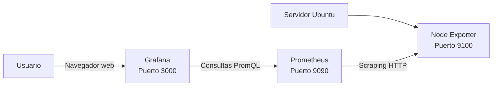

# Prometheus y fuentes de datos

Este bloque presenta **Prometheus**, **Node Exporter**, **PromQL** y la integración de Prometheus como fuente de datos en Grafana.

Durante las prácticas se construirá una plataforma básica de monitorización para un servidor Ubuntu. El alumno aprenderá a instalar los componentes, comprobar su funcionamiento, recopilar métricas, realizar consultas y visualizar los resultados mediante Grafana.

El recorrido completo será:

```text
Servidor Ubuntu
      |
      v
Node Exporter
      |
      | Endpoint HTTP de métricas
      v
Prometheus
      |
      | Consultas PromQL
      v
Grafana
      |
      v
Dashboards y alertas
```

El propósito de este bloque no es únicamente instalar herramientas. También se pretende comprender **qué información proporciona cada componente**, **cómo se comunican entre sí** y **cómo se puede diagnosticar un problema cuando una métrica no aparece**.

---

## Objetivos

Al finalizar este bloque, el alumno podrá:

- Explicar la función de Prometheus en una plataforma de monitorización.
- Describir la arquitectura formada por Prometheus, Node Exporter y Grafana.
- Identificar la función de un *exporter*.
- Diferenciar entre un `job` y un `target`.
- Comprender el modelo de recopilación *pull* utilizado por Prometheus.
- Instalar Prometheus en Ubuntu.
- Crear y configurar un servicio mediante `systemd`.
- Comprobar el estado de Prometheus.
- Consultar los registros de Prometheus mediante `journalctl`.
- Acceder a la interfaz web de Prometheus.
- Ejecutar consultas desde la interfaz web.
- Consultar la API HTTP de Prometheus.
- Instalar Node Exporter.
- Consultar el endpoint `/metrics`.
- Identificar métricas de CPU, memoria, disco y red.
- Configurar objetivos de *scraping*.
- Comprobar el estado de los objetivos configurados.
- Utilizar la métrica `up`.
- Escribir consultas básicas en PromQL.
- Filtrar series mediante etiquetas.
- Utilizar funciones como `rate()`, `avg()`, `sum()` y `count()`.
- Calcular porcentajes de uso de CPU, memoria y almacenamiento.
- Añadir Prometheus como fuente de datos en Grafana.
- Crear un dashboard básico con métricas del sistema.
- Diagnosticar problemas de conectividad y configuración.

---

## Contenidos

El bloque está dividido en los siguientes temas:

### 1. Entorno de laboratorio

Se documenta el sistema donde se realizarán las prácticas:

- Distribución y versión de Ubuntu.
- Hostname.
- Dirección IP.
- Arquitectura.
- Recursos disponibles.
- Usuarios.
- Puertos utilizados.
- Estado inicial del sistema.
- Conectividad de red.
- Sincronización horaria.

### 2. Arquitectura de Prometheus

Se estudian los elementos que forman la plataforma:

- Prometheus.
- Node Exporter.
- Exporters.
- Jobs.
- Targets.
- Scraping.
- Series temporales.
- Etiquetas.
- Almacenamiento.
- PromQL.
- Grafana.

### 3. Instalación de Prometheus

Se instala Prometheus como servicio del sistema:

- Creación del usuario de servicio.
- Descarga del binario.
- Creación de directorios.
- Configuración de permisos.
- Fichero `prometheus.yml`.
- Unidad de `systemd`.
- Inicio automático.
- Comprobación del puerto `9090`.
- Consulta de registros.

### 4. Interfaz web de Prometheus

Se aprende a utilizar la interfaz web para:

- Ejecutar consultas.
- Consultar métricas.
- Cambiar entre tabla y gráfico.
- Revisar objetivos.
- Consultar la configuración.
- Consultar información de ejecución.
- Revisar el estado de los objetivos.

### 5. Instalación de Node Exporter

Se instala Node Exporter para exponer métricas del servidor:

- CPU.
- Memoria.
- Sistemas de ficheros.
- Red.
- Procesos.
- Kernel.
- Tiempo de actividad.

### 6. Configuración del scraping

Se configura Prometheus para consultar Node Exporter:

- `scrape_interval`.
- `scrape_configs`.
- `job_name`.
- `static_configs`.
- `targets`.
- Etiquetas.
- Reinicio del servicio.
- Verificación de objetivos.

### 7. Consultas PromQL

Se introducen las consultas PromQL:

- Selección de métricas.
- Filtros mediante etiquetas.
- Operadores.
- Rangos temporales.
- Agregaciones.
- Funciones.
- Cálculos derivados.
- Uso de `rate()`.
- Agrupación con `by`.

### 8. Añadir Prometheus como fuente de datos

Se conecta Grafana con Prometheus:

- Creación de la fuente de datos.
- Configuración de la URL.
- Prueba de conexión.
- Ejecución de consultas.
- Errores frecuentes.
- Diferencia entre `localhost` y una dirección IP.

### 9. Laboratorio integrador

Se crea un dashboard operativo con:

- Uso de CPU.
- Uso de memoria.
- Uso del almacenamiento.
- Tráfico de red.
- Estado de Node Exporter.
- Consultas PromQL.
- Paneles de Grafana.
- Umbrales.
- Evidencias.

---

## Arquitectura del bloque

La arquitectura básica del laboratorio es la siguiente:



También puede representarse de forma simplificada:

```text
+---------------------+
|   Servidor Ubuntu   |
|                     |
|  Node Exporter      |
|     puerto 9100     |
|                     |
|  Prometheus         |
|     puerto 9090     |
|                     |
|  Grafana            |
|     puerto 3000     |
+---------------------+
```

### Flujo de una métrica

Una métrica sigue este recorrido:

1. El sistema operativo genera información.
2. Node Exporter recopila información del sistema.
3. Node Exporter publica los datos en el endpoint `/metrics`.
4. Prometheus consulta periódicamente ese endpoint.
5. Prometheus almacena las muestras.
6. PromQL permite consultar las series temporales.
7. Grafana ejecuta consultas contra Prometheus.
8. Los paneles muestran los resultados.
9. Las alertas pueden detectar condiciones anómalas.

Ejemplo:

```text
Uso de CPU
    |
    v
node_cpu_seconds_total
    |
    v
Node Exporter :9100
    |
    v
Prometheus :9090
    |
    v
Consulta PromQL
    |
    v
Panel de Grafana
```

---

## Componentes y puertos

| Componente | Función | Puerto habitual | URL |
|---|---|---:|---|
| Grafana | Visualización y dashboards | 3000 | `http://localhost:3000` |
| Prometheus | Recopilación y almacenamiento | 9090 | `http://localhost:9090` |
| Node Exporter | Exposición de métricas | 9100 | `http://localhost:9100/metrics` |

### Comprobación rápida de puertos

```bash
sudo ss -lntp | grep -E ':(3000|9090|9100)\b'
```

### Comprobación de servicios

```bash
for service in grafana-server prometheus node_exporter; do
  printf "%-20s" "$service"

  if systemctl is-active --quiet "$service"; then
    echo "activo"
  else
    echo "no activo"
  fi
done
```

Resultado esperado:

```text
grafana-server       activo
prometheus           activo
node_exporter        activo
```

---

## Conceptos fundamentales

### Prometheus

Prometheus es un sistema de monitorización y una base de datos de series temporales.

Sus funciones principales son:

- Consultar objetivos.
- Recopilar métricas.
- Almacenar muestras.
- Ejecutar consultas PromQL.
- Evaluar reglas de alerta.
- Exponer una API HTTP.

### Node Exporter

Node Exporter es un agente que expone métricas del sistema operativo en un formato que Prometheus puede consultar.

Ejemplo de endpoint:

```text
http://localhost:9100/metrics
```

Ejemplo de métrica:

```text
node_memory_MemTotal_bytes 4.10437632e+09
```

### Job

Un `job` agrupa objetivos que cumplen una función común.

Ejemplo:

```yaml
job_name: node_exporter
```

### Target

Un `target` es un objetivo concreto que Prometheus consulta.

Ejemplo:

```yaml
targets:
  - localhost:9100
```

### Scraping

El *scraping* es el proceso mediante el cual Prometheus consulta periódicamente un endpoint de métricas.

```text
Prometheus ---- consulta ----> Node Exporter
Prometheus <--- métricas ------ Node Exporter
```

### PromQL

PromQL es el lenguaje de consultas de Prometheus.

Ejemplo:

```promql
up
```

Ejemplo con filtro:

```promql
up{job="node_exporter"}
```

---

# Sesiones prácticas

## Sesión 1: revisar el entorno

### Objetivo

Comprobar que el sistema está preparado para realizar el bloque.

### Comandos

Consultar la versión del sistema:

```bash
lsb_release -ds
```

Consultar el hostname:

```bash
hostname
```

Consultar la dirección IP:

```bash
hostname -I
```

Consultar la arquitectura:

```bash
uname -m
```

Consultar la memoria:

```bash
free -h
```

Consultar el espacio libre:

```bash
df -h /
```

Consultar la hora:

```bash
date
```

### Ejemplo de sesión

```console
$ lsb_release -ds
Ubuntu 24.04.5 LTS

$ hostname
monitoring-01

$ hostname -I
192.168.1.50

$ uname -m
x86_64

$ free -h
               total        used        free      shared  buff/cache   available
Mem:           3.8Gi       1.2Gi       620Mi        15Mi       2.0Gi       2.3Gi

$ df -h /
Filesystem      Size  Used Avail Use% Mounted on
/dev/sda2        40G   12G   26G  32% /
```

### Actividades

1. Anota la versión del sistema operativo.
2. Anota el hostname.
3. Anota la dirección IP.
4. Comprueba la arquitectura.
5. Comprueba la memoria disponible.
6. Comprueba el espacio libre.
7. Explica por qué es importante documentar estos datos.

---

## Sesión 2: comprobar la red

### Objetivo

Verificar que el sistema dispone de conectividad y puede descargar los componentes del laboratorio.

### Comandos

Consultar la ruta predeterminada:

```bash
ip route | grep default
```

Consultar la resolución DNS:

```bash
getent hosts github.com
```

Probar conectividad IP:

```bash
ping -c 4 8.8.8.8
```

Probar conectividad mediante nombre:

```bash
ping -c 4 github.com
```

Comprobar acceso HTTPS:

```bash
curl -I https://prometheus.io
```

### Actividades

1. Identifica la puerta de enlace predeterminada.
2. Comprueba si funciona la resolución DNS.
3. Comprueba si funciona el acceso HTTPS.
4. Explica la diferencia entre conectividad IP y resolución DNS.
5. Registra cualquier error observado.

---

## Sesión 3: comprobar Prometheus

### Objetivo

Verificar que Prometheus está instalado, activo y accesible.

Consultar el estado:

```bash
sudo systemctl status prometheus
```

Comprobar si está activo:

```bash
systemctl is-active prometheus
```

Comprobar si se inicia automáticamente:

```bash
systemctl is-enabled prometheus
```

Comprobar el puerto:

```bash
sudo ss -lntp | grep ':9090'
```

Probar la interfaz HTTP:

```bash
curl -I http://localhost:9090
```

Comprobar la salud:

```bash
curl http://localhost:9090/-/healthy
```

Consultar registros:

```bash
sudo journalctl -u prometheus --no-pager -n 30
```

### Resultado esperado

```text
Prometheus is Healthy.
```

### Actividades

1. Comprueba si Prometheus está activo.
2. Comprueba si está habilitado.
3. Comprueba el puerto `9090`.
4. Consulta la respuesta HTTP.
5. Consulta los últimos registros.
6. Anota cualquier mensaje de advertencia o error.

---

## Sesión 4: explorar la interfaz web de Prometheus

### Objetivo

Ejecutar consultas desde la interfaz web de Prometheus.

Abrir en el navegador:

```text
http://localhost:9090
```

Si Prometheus está en otro servidor:

```text
http://<IP-DE-PROMETHEUS>:9090
```

Ejecutar la consulta:

```promql
up
```

Después ejecutar:

```promql
prometheus_build_info
```

Y:

```promql
process_resident_memory_bytes
```

### Consultas iniciales

Consultar el momento de inicio del proceso:

```promql
process_start_time_seconds
```

Consultar el número de muestras almacenadas en memoria:

```promql
prometheus_tsdb_head_samples_appended_total
```

Consultar el número de series:

```promql
prometheus_tsdb_head_series
```

### Actividades

1. Ejecuta la consulta `up`.
2. Cambia entre la vista de tabla y la vista gráfica.
3. Identifica las etiquetas disponibles.
4. Ejecuta una consulta relacionada con la memoria.
5. Anota la versión de Prometheus.
6. Explica qué significa el resultado de `up`.

---

## Sesión 5: comprobar Node Exporter

### Objetivo

Verificar que Node Exporter expone métricas del sistema.

Comprobar el estado:

```bash
sudo systemctl status node_exporter
```

Comprobar el puerto:

```bash
sudo ss -lntp | grep ':9100'
```

Consultar el endpoint:

```bash
curl http://localhost:9100/metrics
```

Mostrar las primeras líneas:

```bash
curl -s http://localhost:9100/metrics | head -n 20
```

Buscar métricas de CPU:

```bash
curl -s http://localhost:9100/metrics \
  | grep '^node_cpu_seconds_total' \
  | head
```

Buscar métricas de memoria:

```bash
curl -s http://localhost:9100/metrics \
  | grep '^node_memory_' \
  | head
```

Buscar métricas de disco:

```bash
curl -s http://localhost:9100/metrics \
  | grep '^node_filesystem_' \
  | head
```

Buscar métricas de red:

```bash
curl -s http://localhost:9100/metrics \
  | grep '^node_network_' \
  | head
```

### Actividades

1. Comprueba que Node Exporter está activo.
2. Comprueba el puerto `9100`.
3. Consulta cinco métricas diferentes.
4. Identifica las etiquetas de una métrica.
5. Explica qué representa `node_memory_MemTotal_bytes`.
6. Explica qué representa `node_memory_MemAvailable_bytes`.

---

## Sesión 6: configurar el scraping

### Objetivo

Configurar Prometheus para que consulte Node Exporter.

Editar el fichero:

```bash
sudo nano /etc/prometheus/prometheus.yml
```

Configuración mínima:

```yaml
global:
  scrape_interval: 15s

scrape_configs:
  - job_name: prometheus
    static_configs:
      - targets:
          - localhost:9090

  - job_name: node_exporter
    static_configs:
      - targets:
          - localhost:9100
```

Reiniciar Prometheus:

```bash
sudo systemctl restart prometheus
```

Comprobar el estado:

```bash
systemctl status prometheus
```

Consultar los objetivos:

```bash
curl -s http://localhost:9090/api/v1/targets | jq
```

Mostrar únicamente el trabajo, la instancia y el estado:

```bash
curl -s http://localhost:9090/api/v1/targets \
  | jq -r '
    .data.activeTargets[]
    | [
        .labels.job,
        .labels.instance,
        .health
      ]
    | @tsv
  '
```

Resultado esperado:

```text
prometheus      localhost:9090  up
node_exporter   localhost:9100  up
```

### Actividades

1. Añade Node Exporter a la configuración.
2. Reinicia Prometheus.
3. Comprueba que el servicio sigue activo.
4. Consulta los objetivos.
5. Comprueba que Node Exporter aparece como `up`.
6. Ejecuta en Prometheus:

```promql
up
```

7. Ejecuta:

```promql
up{job="node_exporter"}
```

---

## Sesión 7: realizar consultas PromQL

### Objetivo

Consultar métricas y calcular indicadores básicos del sistema.

### Comprobar la disponibilidad

```promql
up
```

```promql
up{job="node_exporter"}
```

### Consultar la memoria total

```promql
node_memory_MemTotal_bytes
```

### Consultar la memoria disponible

```promql
node_memory_MemAvailable_bytes
```

### Calcular el uso de memoria

```promql
100 * (
  1 -
  node_memory_MemAvailable_bytes
  /
  node_memory_MemTotal_bytes
)
```

### Consultar el tiempo de actividad

```promql
node_time_seconds - node_boot_time_seconds
```

### Consultar el espacio disponible

```promql
node_filesystem_avail_bytes{
  mountpoint="/",
  fstype!~"tmpfs|overlay"
}
```

### Calcular el uso del sistema de ficheros raíz

```promql
100 * (
  1 -
  node_filesystem_avail_bytes{
    mountpoint="/",
    fstype!~"tmpfs|overlay"
  }
  /
  node_filesystem_size_bytes{
    mountpoint="/",
    fstype!~"tmpfs|overlay"
  }
)
```

### Calcular el uso de CPU

```promql
100 - (
  avg by (instance) (
    rate(node_cpu_seconds_total{mode="idle"}[5m])
  ) * 100
)
```

### Consultar tráfico recibido

```promql
rate(node_network_receive_bytes_total{
  device!="lo"
}[5m])
```

### Consultar tráfico enviado

```promql
rate(node_network_transmit_bytes_total{
  device!="lo"
}[5m])
```

### Actividades

1. Ejecuta la consulta `up`.
2. Filtra por el trabajo `node_exporter`.
3. Consulta la memoria total.
4. Calcula el uso de memoria.
5. Calcula el uso de CPU.
6. Consulta el espacio utilizado en `/`.
7. Consulta el tráfico recibido.
8. Explica para qué sirve `rate()`.
9. Explica por qué se utiliza una ventana de cinco minutos.

---

## Sesión 8: trabajar con etiquetas

### Objetivo

Aprender a filtrar y agrupar series mediante etiquetas.

Consultar todas las interfaces de red:

```promql
node_network_receive_bytes_total
```

Excluir la interfaz de loopback:

```promql
node_network_receive_bytes_total{
  device!="lo"
}
```

Seleccionar interfaces cuyo nombre comience por `en`:

```promql
node_network_receive_bytes_total{
  device=~"en.*"
}
```

Seleccionar el trabajo de Node Exporter:

```promql
up{
  job="node_exporter"
}
```

Seleccionar una instancia concreta:

```promql
up{
  instance="localhost:9100"
}
```

### Operadores de etiquetas

| Operador | Significado |
|---|---|
| `=` | Igual a |
| `!=` | Distinto de |
| `=~` | Coincide con una expresión regular |
| `!~` | No coincide con una expresión regular |

### Actividades

1. Consulta todas las interfaces de red.
2. Excluye la interfaz `lo`.
3. Selecciona las interfaces que comienzan por `en`.
4. Filtra las métricas del trabajo `node_exporter`.
5. Identifica las etiquetas de una métrica.
6. Explica la diferencia entre `=` y `=~`.

---

## Sesión 9: conectar Grafana con Prometheus

### Objetivo

Añadir Prometheus como fuente de datos en Grafana.

Acceder a Grafana:

```text
http://localhost:3000
```

Desde la interfaz:

1. Abrir **Connections**.
2. Seleccionar **Data sources**.
3. Pulsar **Add data source**.
4. Seleccionar **Prometheus**.
5. Introducir la URL:

```text
http://localhost:9090
```

6. Pulsar **Save & test**.
7. Comprobar que la conexión es correcta.

### Si los servicios están en equipos diferentes

Utilizar la dirección accesible desde Grafana:

```text
http://<IP-DE-PROMETHEUS>:9090
```

No utilizar:

```text
http://localhost:9090
```

si Prometheus está en otro servidor. En ese caso, `localhost` hace referencia al equipo donde se ejecuta Grafana.

### Actividades

1. Añade Prometheus como fuente de datos.
2. Ejecuta la consulta:

```promql
up
```

3. Ejecuta la consulta de uso de CPU.
4. Comprueba que Grafana recibe datos.
5. Anota la URL utilizada.
6. Explica qué ocurriría si se introduce un puerto incorrecto.

---

## Sesión 10: crear un dashboard básico

### Objetivo

Crear un dashboard para consultar el estado general del servidor.

Crear un dashboard llamado:

```text
Servidor Linux
```

### Panel 1: uso de CPU

Consulta:

```promql
100 - (
  avg by (instance) (
    rate(node_cpu_seconds_total{mode="idle"}[5m])
  ) * 100
)
```

Configuración recomendada:

```text
Título: Uso de CPU
Visualización: Time series
Unidad: Percent (0-100)
```

### Panel 2: uso de memoria

Consulta:

```promql
100 * (
  1 -
  node_memory_MemAvailable_bytes
  /
  node_memory_MemTotal_bytes
)
```

Configuración recomendada:

```text
Título: Uso de memoria
Visualización: Gauge
Unidad: Percent (0-100)
```

### Panel 3: uso del sistema de ficheros

Consulta:

```promql
100 * (
  1 -
  node_filesystem_avail_bytes{
    mountpoint="/",
    fstype!~"tmpfs|overlay"
  }
  /
  node_filesystem_size_bytes{
    mountpoint="/",
    fstype!~"tmpfs|overlay"
  }
)
```

Configuración recomendada:

```text
Título: Uso de /
Visualización: Gauge
Unidad: Percent (0-100)
```

### Panel 4: estado de Node Exporter

Consulta:

```promql
up{job="node_exporter"}
```

Configuración recomendada:

```text
Título: Estado de Node Exporter
Visualización: Stat
```

### Panel 5: tráfico recibido

Consulta:

```promql
sum by (instance) (
  rate(node_network_receive_bytes_total{
    device!="lo"
  }[5m])
)
```

Configuración recomendada:

```text
Título: Tráfico recibido
Visualización: Time series
Unidad: bytes/sec
```

### Panel 6: memoria disponible

Consulta:

```promql
node_memory_MemAvailable_bytes
```

Configuración recomendada:

```text
Título: Memoria disponible
Visualización: Stat
Unidad: bytes
```

### Actividades

1. Crea el dashboard.
2. Añade los seis paneles.
3. Configura títulos claros.
4. Configura las unidades.
5. Añade umbrales a memoria y disco.
6. Guarda el dashboard.
7. Cambia el rango temporal.
8. Comprueba que todos los paneles muestran datos.
9. Ordena los paneles para facilitar la interpretación.

---

# Práctica integradora

## Objetivo

Construir y documentar una plataforma funcional con Prometheus, Node Exporter y Grafana.

### Requisitos

El alumno debe:

- Utilizar un servidor Ubuntu.
- Tener Prometheus instalado.
- Tener Node Exporter instalado.
- Configurar al menos un objetivo de *scraping*.
- Verificar que el objetivo está en estado `up`.
- Ejecutar consultas PromQL.
- Conectar Grafana con Prometheus.
- Crear un dashboard operativo.
- Guardar evidencias de las comprobaciones.

### Dashboard mínimo

El dashboard debe contener:

- Uso de CPU.
- Uso de memoria.
- Uso del sistema de ficheros raíz.
- Tráfico de red.
- Estado de Node Exporter.
- Memoria disponible.
- Un panel de texto con información del servidor.

### Panel de texto sugerido

```markdown
# Servidor Linux

Dashboard básico de monitorización.

## Componentes

- Node Exporter
- Prometheus
- Grafana

## Métricas

- CPU
- Memoria
- Almacenamiento
- Red
- Disponibilidad del exporter
```

### Evidencias que se deben entregar

Crear una estructura similar a esta:

```text
evidencias/
├── sistema.txt
├── servicios.txt
├── puertos.txt
├── targets-prometheus.json
├── consultas-promql.txt
└── captura-dashboard.png
```

Crear un informe del sistema:

```bash
mkdir -p evidencias

{
  echo "Fecha: $(date)"
  echo "Hostname: $(hostname)"
  echo "IP: $(hostname -I)"
  echo "Sistema: $(lsb_release -ds)"
  echo "Kernel: $(uname -r)"
  echo "Arquitectura: $(uname -m)"
} > evidencias/sistema.txt
```

Crear un informe de servicios:

```bash
for service in grafana-server prometheus node_exporter; do
  echo "===== $service ====="
  systemctl is-active "$service"
  systemctl is-enabled "$service"
done > evidencias/servicios.txt
```

Guardar los puertos:

```bash
sudo ss -lntp \
  | grep -E ':(3000|9090|9100)\b' \
  > evidencias/puertos.txt
```

Guardar los objetivos de Prometheus:

```bash
curl -s http://localhost:9090/api/v1/targets \
  | jq \
  > evidencias/targets-prometheus.json
```

Guardar algunas consultas PromQL:

```bash
cat > evidencias/consultas-promql.txt <<'EOF'
Consulta de disponibilidad:
up

Consulta de Node Exporter:
up{job="node_exporter"}

Uso de memoria:
100 * (
  1 -
  node_memory_MemAvailable_bytes
  /
  node_memory_MemTotal_bytes
)

Uso de CPU:
100 - (
  avg by (instance) (
    rate(node_cpu_seconds_total{mode="idle"}[5m])
  ) * 100
)
EOF
```

---

## Diagnóstico básico

### Prometheus aparece como `down`

Comprobar Node Exporter:

```bash
systemctl status node_exporter
```

Probar directamente el endpoint:

```bash
curl http://localhost:9100/metrics
```

Revisar el target:

```yaml
- job_name: node_exporter
  static_configs:
    - targets:
        - localhost:9100
```

Consultar los registros:

```bash
sudo journalctl -u prometheus --no-pager -n 50
```

### Prometheus no inicia

Consultar el estado:

```bash
systemctl status prometheus
```

Consultar los registros:

```bash
sudo journalctl -u prometheus --no-pager -n 50
```

Revisar especialmente:

- Indentación del YAML.
- Nombre de las propiedades.
- Puertos.
- Rutas.
- Permisos.
- Sintaxis del fichero.
- Objetivos definidos.

### Grafana no conecta con Prometheus

Desde el equipo donde se ejecuta Grafana:

```bash
curl http://localhost:9090/-/healthy
```

Si Prometheus está en otro equipo:

```bash
curl http://<IP-DE-PROMETHEUS>:9090/-/healthy
```

Revisar:

- URL configurada.
- Dirección IP.
- Puerto `9090`.
- Cortafuegos.
- Rutas de red.
- Estado de Prometheus.
- Accesibilidad desde el servidor de Grafana.

### Una consulta no muestra datos

Ejecutar primero:

```promql
up
```

Después:

```promql
up{job="node_exporter"}
```

Si no aparecen datos:

1. Comprobar que Node Exporter está activo.
2. Comprobar que el target está configurado.
3. Comprobar que el target está `up`.
4. Revisar el rango temporal.
5. Comprobar el nombre de la métrica.
6. Revisar las etiquetas.
7. Consultar los registros de Prometheus.

---

## Prácticas relacionadas

Este bloque se desarrolla mediante los siguientes documentos:

1. [Entorno de laboratorio](02-entorno-laboratorio.md)
2. [Arquitectura de Prometheus](03-arquitectura-prometheus.md)
3. [Instalación de Prometheus](04-instalacion-prometheus.md)
4. [Interfaz web de Prometheus](05-interfaz-web-prometheus.md)
5. [Instalación de Node Exporter](06-instalacion-node-exporter.md)
6. [Configuración del scraping](07-configuracion-scrape.md)
7. [Consultas PromQL](08-consultas-promql.md)
8. [Añadir Prometheus como fuente de datos](09-anadir-fuente-datos.md)
9. [Laboratorio integrador](10-laboratorio.md)

---

## Puntos clave

- Prometheus recopila y almacena métricas como series temporales.
- Node Exporter expone métricas del sistema operativo.
- Grafana consulta Prometheus para visualizar los datos.
- Prometheus utiliza normalmente un modelo *pull*.
- Un `job` agrupa objetivos relacionados.
- Un `target` es un endpoint concreto que Prometheus consulta.
- El endpoint habitual de Node Exporter es `/metrics`.
- La métrica `up` permite comprobar la disponibilidad de un objetivo.
- `rate()` permite calcular la velocidad de cambio de una métrica acumulativa.
- Las etiquetas permiten filtrar y agrupar series.
- Grafana y Prometheus deben tener conectividad.
- `localhost` hace referencia al equipo desde el que se realiza la conexión.
- La configuración de Prometheus utiliza YAML.
- Una indentación incorrecta puede impedir que Prometheus se inicie.
- Los dashboards deben utilizar títulos, unidades y umbrales claros.
- Las evidencias facilitan la revisión y el diagnóstico de las prácticas.

---

## Preguntas de comprobación

1. ¿Qué función cumple Prometheus?
2. ¿Qué función cumple Node Exporter?
3. ¿Qué función cumple Grafana?
4. ¿Qué diferencia existe entre un `job` y un `target`?
5. ¿Qué puerto utiliza normalmente Prometheus?
6. ¿Qué puerto utiliza normalmente Node Exporter?
7. ¿Qué contiene el endpoint `/metrics`?
8. ¿Qué significa que un objetivo aparezca como `up`?
9. ¿Qué significa que un objetivo aparezca como `down`?
10. ¿Qué función cumple `scrape_interval`?
11. ¿Qué diferencia existe entre los modelos *push* y *pull*?
12. ¿Para qué sirve la función `rate()`?
13. ¿Por qué se utiliza una ventana como `[5m]`?
14. ¿Cómo se filtra una métrica por la etiqueta `job`?
15. ¿Qué diferencia existe entre `=` y `=~` en PromQL?
16. ¿Cómo comprobarías que Node Exporter está activo?
17. ¿Cómo comprobarías que Prometheus está saludable?
18. ¿Por qué Grafana necesita acceder a Prometheus?
19. ¿Qué problema produce utilizar `localhost` cuando Prometheus está en otro servidor?
20. ¿Qué componentes debe incluir un dashboard operativo?

---

## Criterios de evaluación

| Criterio | Puntuación |
|---|---:|
| Comprensión de la arquitectura | 1 punto |
| Instalación y estado de Prometheus | 2 puntos |
| Instalación y estado de Node Exporter | 1 punto |
| Configuración correcta del scraping | 2 puntos |
| Consultas PromQL | 2 puntos |
| Integración con Grafana | 1 punto |
| Dashboard y evidencias | 1 punto |
| **Total** | **10 puntos** |

### Resultado esperado

Al finalizar este bloque, el alumno debe poder explicar y demostrar el recorrido completo de una métrica:

```text
El sistema genera información
        |
        v
Node Exporter la expone
        |
        v
Prometheus la recopila
        |
        v
PromQL la consulta
        |
        v
Grafana la representa
        |
        v
Una alerta puede detectar una condición anómala
```