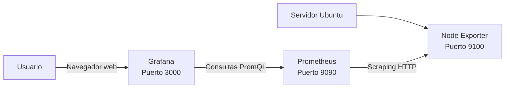

# Entorno de laboratorio

Este documento describe el entorno utilizado durante el bloque **Prometheus y fuentes de datos**.

Antes de instalar o configurar Prometheus, Node Exporter y Grafana, es necesario comprobar que el sistema cumple los requisitos mínimos, que dispone de conectividad y que los puertos necesarios están disponibles.

El laboratorio se realizará sobre un servidor Ubuntu con la siguiente arquitectura:

```text
Servidor Ubuntu
├── Prometheus      :9090
├── Node Exporter   :9100
└── Grafana         :3000
```

Durante las prácticas, los alumnos deberán completar los datos pendientes y conservar las evidencias de las comprobaciones realizadas.

---

## Objetivos

Al finalizar esta sección, el alumno podrá:

- Identificar las características principales del servidor de laboratorio.
- Comprobar la versión y arquitectura del sistema operativo.
- Consultar el hostname y la dirección IP.
- Verificar los recursos disponibles.
- Comprobar la conectividad de red.
- Identificar los puertos utilizados por los componentes del laboratorio.
- Consultar el estado de los servicios mediante `systemctl`.
- Consultar los registros mediante `journalctl`.
- Diferenciar entre usuarios personales y usuarios de servicio.
- Comprobar que Prometheus puede comunicarse con Node Exporter.
- Documentar el entorno antes de comenzar las prácticas.

---

## Sistema operativo

El laboratorio utiliza Ubuntu como sistema operativo base.

| Propiedad | Valor |
|---|---|
| Distribución | Ubuntu |
| Versión | 24.04.5 LTS |
| Codename | Noble |
| Arquitectura | Pendiente |
| Hostname | Pendiente |
| Dirección IP | Pendiente |
| Zona horaria | Pendiente |
| Usuario principal | Pendiente |

### Comprobar la versión de Ubuntu

Ejecutar:

```bash
lsb_release -a
```

Ejemplo de salida:

```console
$ lsb_release -a
No LSB modules are available.
Distributor ID: Ubuntu
Description:    Ubuntu 24.04.5 LTS
Release:        24.04
Codename:       noble
```

También puede consultarse el fichero del sistema:

```bash
cat /etc/os-release
```

Comando abreviado:

```bash
lsb_release -ds
```

Resultado esperado:

```text
Ubuntu 24.04.5 LTS
```

### Comprobar la arquitectura

```bash
uname -m
```

Resultado habitual:

```text
x86_64
```

Consultar información completa del kernel:

```bash
uname -a
```

La arquitectura `x86_64` también puede aparecer como `amd64`.

### Comprobar el hostname

```bash
hostname
```

También puede utilizarse:

```bash
hostnamectl
```

Ejemplo:

```console
$ hostname
prometheus-lab-01
```

Registrar el resultado:

```text
Hostname: ________________________________
```

### Comprobar la dirección IP

Consultar las interfaces de red:

```bash
ip address
```

Mostrar únicamente las direcciones IPv4:

```bash
ip -4 address
```

Consultar la dirección IP asignada al equipo:

```bash
hostname -I
```

Ejemplo:

```console
$ hostname -I
192.168.1.50
```

Consultar la ruta predeterminada:

```bash
ip route
```

Ejemplo:

```console
$ ip route
default via 192.168.1.1 dev ens33
192.168.1.0/24 dev ens33 proto kernel scope link src 192.168.1.50
```

Registrar los datos:

```text
Interfaz principal: ______________________
Dirección IPv4: __________________________
Prefijo de red: __________________________
Puerta de enlace: ________________________
```

> La dirección IP puede ser diferente en cada laboratorio. Puede utilizarse una red física, una máquina virtual, NAT, bridge o una red interna.

---

## Recursos del sistema

Los componentes del laboratorio pueden ejecutarse en un entorno pequeño, aunque se recomienda disponer de suficientes recursos para que las consultas y los dashboards funcionen con fluidez.

### Recursos recomendados

| Recurso | Mínimo recomendado |
|---|---:|
| CPU | 2 núcleos |
| Memoria RAM | 4 GB |
| Almacenamiento libre | 20 GB |
| Arquitectura | `amd64` / `x86_64` |
| Acceso administrativo | Usuario con `sudo` |
| Conectividad | Acceso a Internet |

### Consultar los procesadores

```bash
nproc
```

Consultar información detallada:

```bash
lscpu
```

Ejemplo:

```console
$ nproc
2
```

### Consultar la memoria

```bash
free -h
```

Ejemplo:

```console
$ free -h
               total        used        free      shared  buff/cache   available
Mem:           3.8Gi       1.2Gi       620Mi        15Mi       2.0Gi       2.3Gi
Swap:          2.0Gi          0B       2.0Gi
```

La columna `available` es especialmente útil porque indica una estimación de la memoria que puede utilizarse sin recurrir inmediatamente a la memoria de intercambio.

### Consultar el almacenamiento

Consultar el espacio disponible:

```bash
df -h
```

Consultar únicamente el sistema de ficheros raíz:

```bash
df -h /
```

Ejemplo:

```console
$ df -h /
Filesystem      Size  Used Avail Use% Mounted on
/dev/sda2        40G   12G   26G  32% /
```

Consultar los dispositivos:

```bash
lsblk
```

### Consultar la carga del sistema

```bash
uptime
```

Ejemplo:

```console
$ uptime
 10:25:12 up 2 days, 4:15, 1 user, load average: 0.12, 0.18, 0.20
```

### Actividad

Completar la siguiente tabla:

| Recurso | Valor detectado |
|---|---|
| CPU disponibles | |
| Memoria total | |
| Memoria disponible | |
| Espacio total en `/` | |
| Espacio libre en `/` | |
| Carga del sistema | |

---

# Componentes del laboratorio

El entorno está formado por tres componentes principales.

| Componente | Función | Versión | Puerto | Estado |
|---|---|---:|---:|---|
| Grafana | Visualización y dashboards | Pendiente | 3000 | Pendiente |
| Prometheus | Recopilación y almacenamiento | Pendiente | 9090 | Pendiente |
| Node Exporter | Exposición de métricas del sistema | Pendiente | 9100 | Pendiente |

---

## Grafana

Grafana proporciona la interfaz web desde la que se consultan y visualizan las métricas almacenadas en Prometheus.

Funciones principales:

- Crear dashboards.
- Crear paneles.
- Consultar datos mediante PromQL.
- Configurar unidades.
- Definir umbrales.
- Crear alertas.
- Comparar rangos temporales.

URL habitual:

```text
http://<DIRECCION_IP>:3000
```

Ejemplo:

```text
http://192.168.1.50:3000
```

Comprobar si el binario está instalado:

```bash
command -v grafana-server
```

Consultar la versión:

```bash
grafana-server -v
```

Consultar el estado:

```bash
sudo systemctl status grafana-server
```

Comprobar el puerto:

```bash
sudo ss -lntp | grep ':3000'
```

Probar la respuesta HTTP:

```bash
curl -I http://localhost:3000
```

Consultar los registros:

```bash
sudo journalctl -u grafana-server --no-pager -n 30
```

---

## Prometheus

Prometheus recopila y almacena métricas como series temporales.

Funciones principales:

- Consultar objetivos.
- Realizar operaciones de *scraping*.
- Almacenar métricas.
- Ejecutar consultas PromQL.
- Evaluar reglas de alerta.
- Proporcionar una API HTTP.

URL habitual:

```text
http://<DIRECCION_IP>:9090
```

Ejemplo:

```text
http://192.168.1.50:9090
```

Consultar la versión:

```bash
prometheus --version
```

Consultar el estado:

```bash
sudo systemctl status prometheus
```

Comprobar el puerto:

```bash
sudo ss -lntp | grep ':9090'
```

Comprobar la salud del servicio:

```bash
curl http://localhost:9090/-/healthy
```

Resultado esperado:

```text
Prometheus is Healthy.
```

Consultar los registros:

```bash
sudo journalctl -u prometheus --no-pager -n 30
```

---

## Node Exporter

Node Exporter expone métricas del sistema operativo en un formato que Prometheus puede consultar.

Métricas habituales:

- Uso de CPU.
- Memoria total y disponible.
- Sistemas de ficheros.
- Tráfico de red.
- Tiempo de actividad.
- Procesos.
- Información del kernel.

Endpoint habitual:

```text
http://<DIRECCION_IP>:9100/metrics
```

Ejemplo:

```text
http://192.168.1.50:9100/metrics
```

Consultar la versión:

```bash
node_exporter --version
```

Consultar el estado:

```bash
sudo systemctl status node_exporter
```

Comprobar el puerto:

```bash
sudo ss -lntp | grep ':9100'
```

Consultar las métricas:

```bash
curl http://localhost:9100/metrics
```

Mostrar las primeras líneas:

```bash
curl -s http://localhost:9100/metrics | head -n 20
```

Buscar métricas de memoria:

```bash
curl -s http://localhost:9100/metrics \
  | grep '^node_memory_' \
  | head
```

---

# Arquitectura

La arquitectura del entorno es la siguiente:



También puede representarse de forma simplificada:

```text
Sistema operativo
       |
       v
Node Exporter :9100
       |
       | Scraping
       v
Prometheus :9090
       |
       | PromQL
       v
Grafana :3000
       |
       v
Navegador del usuario
```

## Flujo de una métrica

1. El sistema operativo genera información.
2. Node Exporter recopila esa información.
3. Node Exporter publica las métricas en `/metrics`.
4. Prometheus consulta periódicamente el endpoint.
5. Prometheus almacena las muestras.
6. PromQL permite consultar los datos.
7. Grafana consulta Prometheus.
8. Los paneles muestran los resultados.

Ejemplo:

```text
CPU del servidor
      |
      v
node_cpu_seconds_total
      |
      v
Node Exporter :9100
      |
      v
Prometheus :9090
      |
      v
Consulta PromQL
      |
      v
Panel de Grafana
```

---

# Usuarios y permisos

## Usuario principal

El usuario principal es el utilizado por el alumno para realizar las prácticas.

Consultar el usuario actual:

```bash
whoami
```

Consultar su identidad:

```bash
id
```

Consultar sus grupos:

```bash
groups
```

Comprobar los permisos administrativos:

```bash
sudo -v
```

Ejemplo:

```console
$ whoami
alumno

$ id
uid=1000(alumno) gid=1000(alumno) groups=1000(alumno),27(sudo)
```

Completar:

```text
Usuario principal: _______________________
UID: _____________________________________
Grupo principal: _________________________
¿Puede utilizar sudo?: ___________________
```

## Usuarios de servicio

Cada componente debería ejecutarse, preferiblemente, con un usuario de servicio específico.

| Usuario | Servicio | Función |
|---|---|---|
| `grafana` | Grafana | Ejecutar Grafana |
| `prometheus` | Prometheus | Ejecutar Prometheus |
| `node_exporter` | Node Exporter | Exponer métricas |

Consultar los usuarios:

```bash
getent passwd grafana
getent passwd prometheus
getent passwd node_exporter
```

Ejemplo:

```console
$ getent passwd node_exporter
node_exporter:x:998:998::/home/node_exporter:/usr/sbin/nologin
```

El shell `/usr/sbin/nologin` evita que el usuario de servicio se utilice normalmente para iniciar sesiones interactivas.

## Comprobar el usuario de ejecución

Consultar el usuario configurado en systemd:

```bash
systemctl show grafana-server -p User
systemctl show prometheus -p User
systemctl show node_exporter -p User
```

Consultar los procesos:

```bash
ps -ef | grep '[g]rafana'
ps -ef | grep '[p]rometheus'
ps -ef | grep '[n]ode_exporter'
```

## Recomendaciones de seguridad

- No ejecutar los servicios como `root` si no es necesario.
- No compartir contraseñas entre alumnos.
- No publicar credenciales en repositorios.
- No exponer los puertos del laboratorio directamente a Internet.
- Utilizar una red interna o un cortafuegos.
- Mantener Ubuntu actualizado.
- Revisar los permisos de los ficheros de configuración.
- No incluir contraseñas en capturas de pantalla.

---

# Puertos del laboratorio

| Servicio | Puerto | Protocolo | Finalidad |
|---|---:|---|---|
| Grafana | 3000 | TCP | Interfaz web |
| Prometheus | 9090 | TCP | Interfaz y API |
| Node Exporter | 9100 | TCP | Endpoint de métricas |
| SSH | 22 | TCP | Administración remota |

## Consultar los puertos en escucha

```bash
sudo ss -lntp
```

Filtrar los puertos del laboratorio:

```bash
sudo ss -lntp | grep -E ':(3000|9090|9100)\b'
```

Comprobar cada puerto:

```bash
for port in 3000 9090 9100; do
  echo "===== Puerto $port ====="

  if sudo ss -lnt "( sport = :$port )" | grep -q LISTEN; then
    echo "En escucha"
  else
    echo "No está en escucha"
  fi
done
```

Identificar qué proceso utiliza un puerto:

```bash
sudo lsof -iTCP:3000 -sTCP:LISTEN
```

Sustituir `3000` para consultar los demás puertos:

```bash
sudo lsof -iTCP:9090 -sTCP:LISTEN
sudo lsof -iTCP:9100 -sTCP:LISTEN
```

---

# Verificaciones iniciales

## Verificación 1: sistema operativo

```bash
lsb_release -ds
```

Resultado esperado:

```text
Ubuntu 24.04.5 LTS
```

## Verificación 2: arquitectura

```bash
uname -m
```

Resultado esperado:

```text
x86_64
```

## Verificación 3: hostname

```bash
hostname
```

## Verificación 4: dirección IP

```bash
hostname -I
```

## Verificación 5: hora del sistema

Consultar el estado:

```bash
timedatectl status
```

Comprobar si está sincronizado:

```bash
timedatectl show -p NTPSynchronized --value
```

Resultado esperado:

```text
yes
```

Consultar la zona horaria:

```bash
timedatectl show -p Timezone --value
```

Una hora incorrecta puede provocar:

- Métricas aparentemente desordenadas.
- Dashboards vacíos.
- Comparaciones temporales incorrectas.
- Problemas al correlacionar métricas y logs.
- Evaluación incorrecta de alertas.

## Verificación 6: conectividad

Consultar la ruta predeterminada:

```bash
ip route | grep default
```

Comprobar DNS:

```bash
getent hosts archive.ubuntu.com
```

Probar conectividad IP:

```bash
ping -c 4 8.8.8.8
```

Probar conectividad mediante nombre:

```bash
ping -c 4 archive.ubuntu.com
```

Probar HTTPS:

```bash
curl -I https://prometheus.io
```

## Verificación 7: estado de servicios

```bash
for service in grafana-server prometheus node_exporter; do
  printf "%-20s" "$service"

  if systemctl is-active --quiet "$service"; then
    echo "activo"
  else
    echo "no activo"
  fi
done
```

Comprobar el inicio automático:

```bash
for service in grafana-server prometheus node_exporter; do
  printf "%-20s" "$service"
  systemctl is-enabled "$service" 2>/dev/null || true
done
```

## Verificación 8: endpoints HTTP

### Grafana

```bash
curl -I http://localhost:3000
```

### Prometheus

```bash
curl -I http://localhost:9090
```

### Node Exporter

```bash
curl -I http://localhost:9100/metrics
```

---

# Sesiones prácticas

## Sesión 1: inventario del sistema

### Objetivo

Recopilar la información básica del servidor de laboratorio.

### Comandos

```bash
echo "Hostname: $(hostname)"
echo "IP: $(hostname -I | awk '{print $1}')"
echo "Sistema: $(lsb_release -ds)"
echo "Arquitectura: $(uname -m)"
echo "Kernel: $(uname -r)"
echo "CPUs: $(nproc)"
echo "Zona horaria: $(timedatectl show -p Timezone --value)"
```

### Ejemplo de salida

```console
Hostname: prometheus-lab-01
IP: 192.168.1.50
Sistema: Ubuntu 24.04.5 LTS
Arquitectura: x86_64
Kernel: 6.8.0-40-generic
CPUs: 2
Zona horaria: Europe/Madrid
```

### Actividades

1. Ejecuta los comandos.
2. Completa la tabla del sistema operativo.
3. Guarda la salida en un fichero:

```bash
mkdir -p ~/laboratorio-grafana/evidencias

{
  echo "Fecha: $(date)"
  echo "Hostname: $(hostname)"
  echo "IP: $(hostname -I)"
  echo "Sistema: $(lsb_release -ds)"
  echo "Arquitectura: $(uname -m)"
  echo "Kernel: $(uname -r)"
  echo "CPUs: $(nproc)"
} | tee ~/laboratorio-grafana/evidencias/inventario-sistema.txt
```

---

## Sesión 2: comprobar recursos

### Objetivo

Verificar que el servidor tiene recursos suficientes.

### Comandos

```bash
nproc
free -h
df -h /
uptime
```

### Actividades

1. Anota el número de CPUs.
2. Anota la memoria total.
3. Anota la memoria disponible.
4. Anota el espacio libre en `/`.
5. Anota la carga del sistema.
6. Explica si el equipo puede utilizarse para el laboratorio.

---

## Sesión 3: comprobar usuarios

### Objetivo

Identificar el usuario del alumno y los usuarios de servicio.

### Comandos

```bash
whoami
id
groups
```

Consultar usuarios de servicio:

```bash
getent passwd grafana
getent passwd prometheus
getent passwd node_exporter
```

Comprobar permisos administrativos:

```bash
sudo -v
```

### Actividades

1. Identifica el usuario principal.
2. Comprueba si pertenece al grupo `sudo`.
3. Comprueba si existen los usuarios de servicio.
4. Explica por qué los servicios no deberían ejecutarse con el usuario personal del alumno.
5. Registra los resultados.

---

## Sesión 4: comprobar puertos

### Objetivo

Relacionar cada componente con su puerto de escucha.

### Comando

```bash
sudo ss -lntp | grep -E ':(3000|9090|9100)\b'
```

### Actividades

Completar la tabla:

| Servicio | Puerto | Proceso | Dirección de escucha |
|---|---:|---|---|
| Grafana | 3000 | | |
| Prometheus | 9090 | | |
| Node Exporter | 9100 | | |

### Pregunta

Explica la diferencia entre:

```text
127.0.0.1:9090
```

y:

```text
0.0.0.0:9090
```

Orientación:

- `127.0.0.1` permite conexiones desde el propio equipo.
- `0.0.0.0` indica que el servicio escucha en todas las interfaces IPv4, sujeto al cortafuegos.

---

## Sesión 5: probar los servicios

### Objetivo

Comprobar que los tres componentes responden.

### Grafana

```bash
curl -I http://localhost:3000
```

### Prometheus

```bash
curl -I http://localhost:9090
```

### Node Exporter

```bash
curl -I http://localhost:9100/metrics
```

### Actividades

Completar:

| Servicio | URL | Código HTTP | Resultado |
|---|---|---:|---|
| Grafana | `http://localhost:3000` | | |
| Prometheus | `http://localhost:9090` | | |
| Node Exporter | `http://localhost:9100/metrics` | | |

Un código `200` indica normalmente que el recurso se ha servido correctamente. Grafana puede responder con un código de redirección dependiendo de su configuración.

---

## Sesión 6: consultar métricas de Node Exporter

### Objetivo

Comprobar que Node Exporter expone métricas reales del sistema.

Consultar la memoria total:

```bash
curl -s http://localhost:9100/metrics \
  | grep '^node_memory_MemTotal_bytes'
```

Consultar la memoria disponible:

```bash
curl -s http://localhost:9100/metrics \
  | grep '^node_memory_MemAvailable_bytes'
```

Consultar métricas de CPU:

```bash
curl -s http://localhost:9100/metrics \
  | grep '^node_cpu_seconds_total' \
  | head
```

Consultar métricas de disco:

```bash
curl -s http://localhost:9100/metrics \
  | grep '^node_filesystem_size_bytes' \
  | head
```

Consultar métricas de red:

```bash
curl -s http://localhost:9100/metrics \
  | grep '^node_network_receive_bytes_total' \
  | head
```

### Actividades

1. Localiza una métrica de memoria.
2. Localiza una métrica de CPU.
3. Localiza una métrica de almacenamiento.
4. Localiza una métrica de red.
5. Identifica las etiquetas de cada métrica.
6. Explica qué representa la unidad `_bytes`.

---

## Sesión 7: comprobar los objetivos de Prometheus

### Objetivo

Comprobar que Prometheus puede consultar sus objetivos.

Consultar la API de objetivos:

```bash
curl -s http://localhost:9090/api/v1/targets
```

Mostrar la respuesta con formato legible:

```bash
curl -s http://localhost:9090/api/v1/targets | jq
```

Mostrar el estado de cada objetivo:

```bash
curl -s http://localhost:9090/api/v1/targets \
  | jq -r '
    .data.activeTargets[]
    | [
        .labels.job,
        .labels.instance,
        .health,
        .lastError
      ]
    | @tsv
  '
```

Ejemplo:

```text
prometheus      localhost:9090  up
node_exporter   localhost:9100  up
```

### Actividades

1. Ejecuta la consulta.
2. Identifica los trabajos configurados.
3. Identifica las instancias.
4. Comprueba el estado `health`.
5. Registra cualquier valor de `lastError`.
6. Explica qué significa que un objetivo aparezca como `down`.

---

## Sesión 8: generar un informe de estado

### Objetivo

Crear un informe con el estado general del laboratorio.

Crear el directorio de evidencias:

```bash
mkdir -p ~/laboratorio-grafana/evidencias
```

Crear el informe:

```bash
cat > ~/laboratorio-grafana/evidencias/estado-laboratorio.txt <<EOF
Fecha: $(date)
Hostname: $(hostname)
IP: $(hostname -I | awk '{print $1}')
Sistema: $(lsb_release -ds)
Arquitectura: $(uname -m)
Kernel: $(uname -r)
CPUs: $(nproc)

Estado de los servicios:
Grafana: $(systemctl is-active grafana-server 2>/dev/null || echo no-disponible)
Prometheus: $(systemctl is-active prometheus 2>/dev/null || echo no-disponible)
Node Exporter: $(systemctl is-active node_exporter 2>/dev/null || echo no-disponible)

Puertos:
$(sudo ss -lntp | grep -E ':(3000|9090|9100)\b' || true)
EOF
```

Consultar el informe:

```bash
cat ~/laboratorio-grafana/evidencias/estado-laboratorio.txt
```

### Actividades

1. Ejecuta el script.
2. Revisa el contenido.
3. Añade el nombre del alumno.
4. Añade el grupo.
5. Añade las incidencias encontradas.
6. Guarda el informe como evidencia.

---

# Diagnóstico básico

## Grafana no responde

Comprobar el servicio:

```bash
systemctl status grafana-server
```

Consultar los registros:

```bash
sudo journalctl -u grafana-server --no-pager -n 50
```

Comprobar el puerto:

```bash
sudo ss -lntp | grep ':3000'
```

Probar localmente:

```bash
curl -I http://localhost:3000
```

## Prometheus no responde

Comprobar el servicio:

```bash
systemctl status prometheus
```

Consultar los registros:

```bash
sudo journalctl -u prometheus --no-pager -n 50
```

Comprobar el puerto:

```bash
sudo ss -lntp | grep ':9090'
```

Comprobar la salud:

```bash
curl http://localhost:9090/-/healthy
```

## Node Exporter no responde

Comprobar el servicio:

```bash
systemctl status node_exporter
```

Consultar los registros:

```bash
sudo journalctl -u node_exporter --no-pager -n 50
```

Comprobar el puerto:

```bash
sudo ss -lntp | grep ':9100'
```

Probar el endpoint:

```bash
curl http://localhost:9100/metrics
```

## Un puerto está ocupado por otro proceso

Identificar el proceso:

```bash
sudo ss -lntp | grep ':3000'
```

También puede utilizarse:

```bash
sudo lsof -iTCP:3000 -sTCP:LISTEN
```

No se debe detener un proceso desconocido sin identificar antes su función.

## Prometheus muestra un objetivo `down`

Revisar el estado de Node Exporter:

```bash
systemctl is-active node_exporter
```

Probar el endpoint directamente:

```bash
curl http://localhost:9100/metrics
```

Revisar la configuración:

```bash
sudo cat /etc/prometheus/prometheus.yml
```

Consultar los registros de Prometheus:

```bash
sudo journalctl -u prometheus --no-pager -n 50
```

## Grafana no conecta con Prometheus

Si ambos servicios están en el mismo servidor:

```bash
curl http://localhost:9090/-/healthy
```

Si están en servidores diferentes:

```bash
curl http://<IP-DE-PROMETHEUS>:9090/-/healthy
```

Revisar:

- La URL configurada.
- La dirección IP.
- El puerto `9090`.
- Las reglas del cortafuegos.
- La conectividad entre servidores.
- El estado de Prometheus.

---

# Ficha del entorno

## Datos generales

| Propiedad | Valor |
|---|---|
| Alumno | |
| Grupo | |
| Fecha | |
| Distribución | Ubuntu |
| Versión | 24.04.5 LTS |
| Hostname | |
| Dirección IP | |
| Arquitectura | |
| Kernel | |
| CPUs | |
| Memoria total | |
| Espacio libre en `/` | |
| Zona horaria | |
| Usuario principal | |

## Componentes

| Componente | Versión | Puerto | Estado | Inicio automático |
|---|---|---:|---|---|
| Grafana | | 3000 | | |
| Prometheus | | 9090 | | |
| Node Exporter | | 9100 | | |

## Verificaciones

| Verificación | Resultado | Observaciones |
|---|---|---|
| Sistema operativo | | |
| Arquitectura | | |
| Hostname | | |
| Dirección IP | | |
| Recursos | | |
| Conectividad | | |
| DNS | | |
| Sincronización horaria | | |
| Puerto 3000 | | |
| Puerto 9090 | | |
| Puerto 9100 | | |
| Grafana | | |
| Prometheus | | |
| Node Exporter | | |
| Objetivos de Prometheus | | |

---

## Puntos clave

- El laboratorio utiliza Ubuntu como sistema operativo base.
- Grafana utiliza normalmente el puerto `3000`.
- Prometheus utiliza normalmente el puerto `9090`.
- Node Exporter utiliza normalmente el puerto `9100`.
- Grafana visualiza los datos almacenados en Prometheus.
- Prometheus recopila métricas mediante *scraping*.
- Node Exporter expone métricas del sistema mediante `/metrics`.
- `systemctl` permite consultar el estado de los servicios.
- `journalctl` permite consultar los registros.
- `curl` permite verificar rápidamente los endpoints HTTP.
- La métrica `up` permite comprobar la disponibilidad de los objetivos.
- La hora del sistema debe estar sincronizada.
- Los usuarios de servicio reducen los privilegios innecesarios.
- Los puertos y las direcciones IP deben documentarse antes de comenzar.
- Las evidencias ayudan a reproducir y diagnosticar las prácticas.

---

## Preguntas de comprobación

1. ¿Qué versión de Ubuntu utiliza el laboratorio?
2. ¿Qué comando permite consultar el hostname?
3. ¿Qué comando muestra la dirección IP?
4. ¿Qué comando permite consultar la arquitectura?
5. ¿Qué función cumple Grafana?
6. ¿Qué función cumple Prometheus?
7. ¿Qué función cumple Node Exporter?
8. ¿Qué puerto utiliza Grafana?
9. ¿Qué puerto utiliza Prometheus?
10. ¿Qué puerto utiliza Node Exporter?
11. ¿Qué contiene el endpoint `/metrics`?
12. ¿Qué diferencia existe entre `localhost` y una dirección IP de red?
13. ¿Qué comando permite comprobar si un puerto está en escucha?
14. ¿Qué comando permite consultar los registros de Prometheus?
15. ¿Qué significa que un objetivo de Prometheus esté `up`?
16. ¿Qué significa que un objetivo esté `down`?
17. ¿Por qué es importante sincronizar la hora?
18. ¿Por qué se utilizan usuarios de servicio?
19. ¿Cómo comprobarías que Prometheus está saludable?
20. ¿Cómo comprobarías que Node Exporter responde correctamente?

---

## Criterios de finalización

El entorno se considera preparado cuando:

- Se ha identificado la versión de Ubuntu.
- Se ha registrado el hostname.
- Se ha registrado la dirección IP.
- Se ha comprobado la arquitectura.
- Se han revisado los recursos disponibles.
- Se ha comprobado la conectividad.
- Se ha comprobado la sincronización horaria.
- Se han identificado los usuarios de servicio.
- Grafana responde en el puerto `3000`.
- Prometheus responde en el puerto `9090`.
- Node Exporter responde en el puerto `9100`.
- Prometheus puede consultar sus objetivos.
- Se ha completado la ficha del entorno.
- Se ha guardado un informe de evidencias.

El resultado final debe permitir responder rápidamente a estas preguntas:

```text
¿Qué sistema operativo utiliza el laboratorio?
¿Qué hostname tiene el servidor?
¿Qué dirección IP tiene?
¿Qué servicios están instalados?
¿Qué versión tiene cada servicio?
¿En qué puerto escucha cada componente?
¿Están activos los servicios?
¿Puede Prometheus consultar Node Exporter?
¿Puede Grafana consultar Prometheus?
```